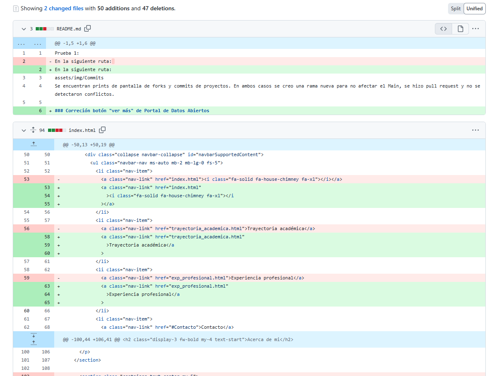
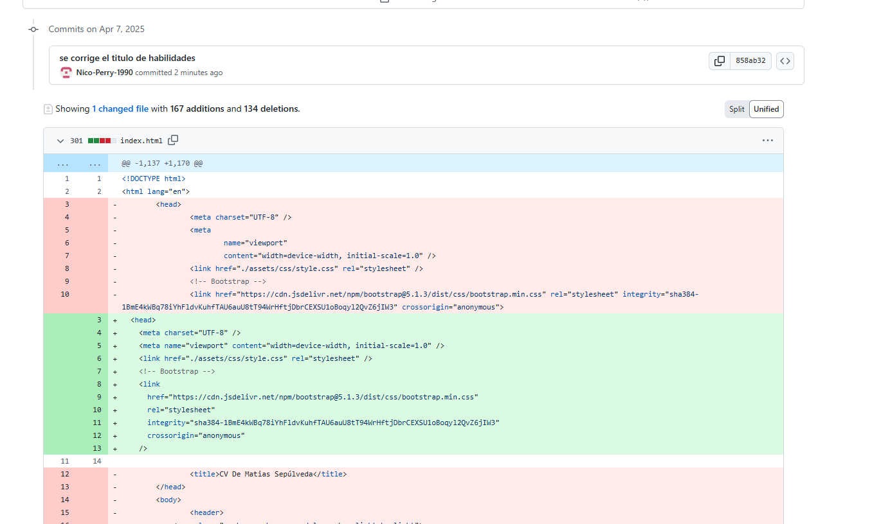

# desafio-final

## Desarrollo del desafío final.

### Comienzo del proyecto final del primer módulo

    1. Se agrega Index y carpetas de CSS e Imágenes
    2. Se crea el archivo README.md

---

### Se introduce Bootstrap

---

### Actualización HTML y se agregan archivo CSS

    1- Se agrega sidebar
    2- Se agrega archivo CSS
    3- Se agrega logo

---

### Segunda actualización HTML y CSS

    1-Se estiliza el SideBar
    2-Se agrega Hero Section
    3-Se agrega divshaper
    4-Se agrega Script para desplazamiento dentro de la pagina.

---

### Tercera actualización HTML y CSS

    1-Se agrega seccion sobre mi experiencia y mi educación
    2-Se modifica la fuente del sitio
    3-Se agrega FA

---

### Tercera actualización HTML y CSS

    1-Se agregan imágenes para completar el portafolio
    2-se estructura el portafolio en base a cartas

---

### Tercera actualización HTML y CSS

    1-Se agrega seccion contactame

---

### Tercera actualización HTML y CSS

    1-se agrega URL  proyectos antiguos en la sección de portafolio.
    2-agrega favicon

### Fork y Commit (1)

Se realiza fork al proyecto de Felipe Torres (https://github.com/Nico-Perry-1990/prueba1_desafio_latam.git)

### Fork y Commit (2)

Se realiza fork al proyecto de Matistr

